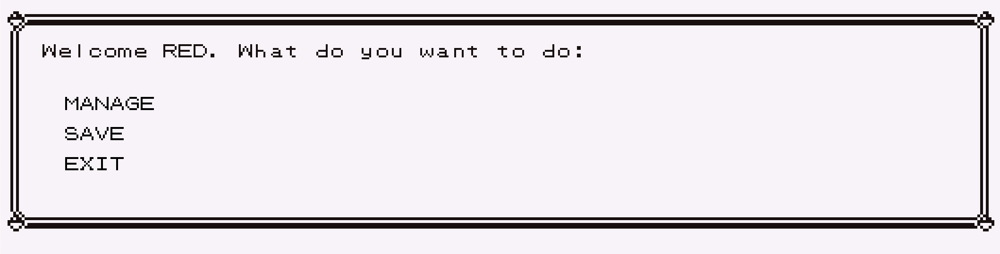
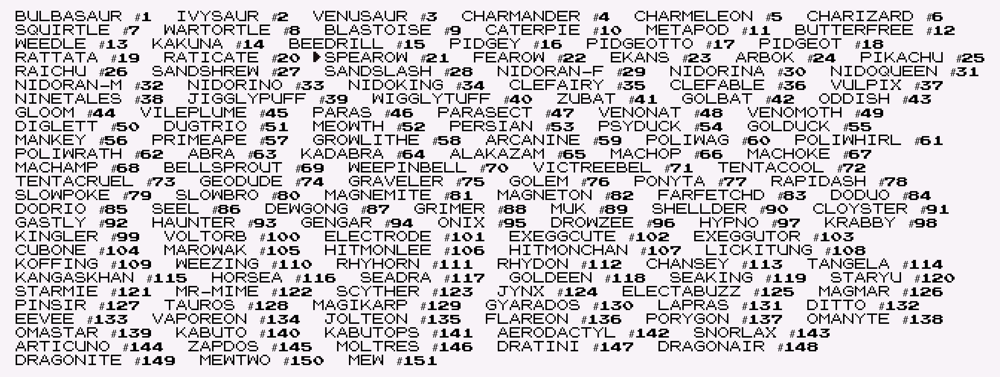
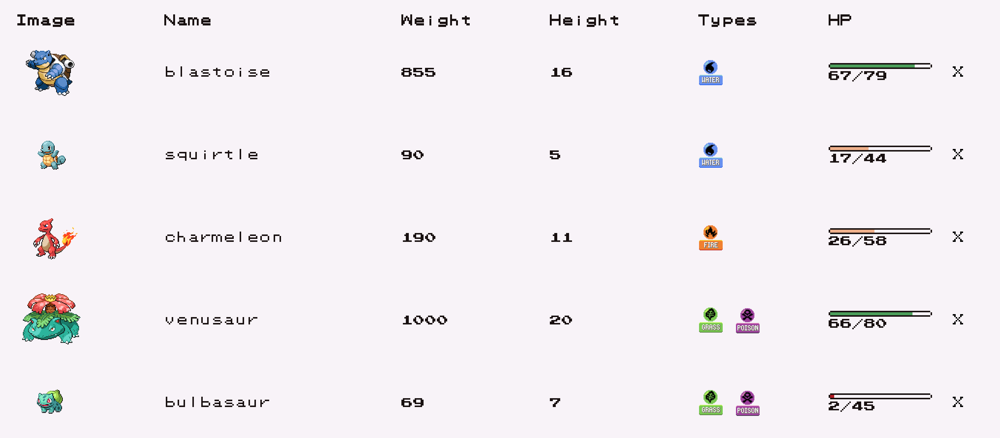
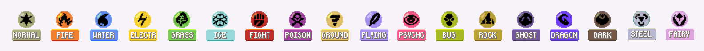
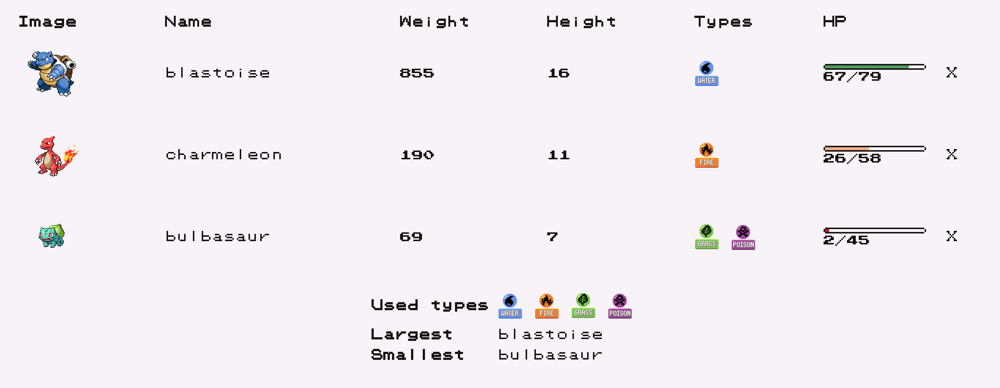

# Labo 11-12

## Pokedexpress 

### Project Beschrijving 

In deze opgave gaan we een uitgebreide Pokedex applicatie bouwen met Node/Express en MongoDB.

### Startproject 

Een groot deel van de applicatie routes en views zijn al op voorhand klaargemaakt. Je mag dit project gebruiken om van te starten.

Er zitten hier een aantal voorgeprogrammeerde vaste waarden in om alles te doen werken. Je moet uiteraard deze wegwerken zodat de applicatie volledig werkt met mongoDB.



### Header/Footer 

Zorg ervoor dat alle pagina's de header en de footer includeert zodat de css automatisch wordt toegepast op elke pagina.

In het begin zal je pagina er zo uit zien:

 (1) (1) (1) (1) (1) (1) (1) (1) (1).png>)

Met de header en footer ziet ze er als volgt uit:

### Start Pagina 

De start pagina ziet er als volgt uit. Als je naar de root path gaat ([http://localhost:3000](http://localhost:3000/)) dan krijg je de volgende pagina te zien.

De gebruiker krijgt hier een invoerveld te zien met daarnaast een Submit knop. Als deze submit knop wordt aangeklikt dan wordt er in de database een nieuwe Player aangemaakt met de meegegeven naam.

Na het aanmaken wordt de gebruiker terug naar deze root pagina gestuurd (met `res.redirect("/")`) en krijgt de gebruiker zijn naam te zien in een lijst:

De gebruiker kan dan vervolgens op zijn naam klikken en wordt dan naar zijn persoonlijke hoofdpagina gestuurd.

**Belangrijk:** Het aanmaken van de Player gebeurt direct in de database maar er dient wel een array bij gehouden te worden met alle Players. Deze wordt in het begin van de applicatie ingeladen. Zorg ervoor dat deze ook geupdated wordt na het aanpassen van de database. Zo moeten we dus niet elke keer een database call doen telkens de gebruiker moet opgevraagd worden.

### De Player pagina 

De player pagina bevindt zich op de route

`/player/:id`

waarvan de id overeenkomt met de database id in mongodb.

Hier staan 3 knoppen:

*   Als de gebruiker klikt op MANAGE dan gaat de gebruiker naar zijn Pokemon page op de route

    `/player/:id/pokemon`
* Als de gebruiker klikt op EXIT moet je terug naar de root page (/) gaan.
* Als de gebruiker op SAVE klikt zal de huidige gebruiker aangepast worden in de database. De verdere werking van dit wordt nog later in detail toegelicht. Je mag deze momenteel dus even negeren.

### De Pokemon pagina 

De pokemon pagina bestaat uit 2 delen:

* Het overzicht van het pokemon team van de Player.
* Een overzicht van alle pokemon met nummers 1 tot en met 151.

We zullen met de laatste beginnen.

#### Pokemon overzicht 

Gebruik [https://pokeapi.co/](https://pokeapi.co/) om alle pokemon met id 1 tot en met 151 in te laden. Slaag deze op in een mongodb database.

Zorg ervoor dat je enkel de nodige data opslaagt in de database. Je mag dus niet gewoon het originele json object in de database opslagen.

We houden de volgende data van een pokemon bij:

* id: getal
* name: tekst
* types: een lijst van types (bv. grass, fire)
* image: de url van de image
* height: de hoogte van de pokemon
* weight: het gewicht van de pokemon
* maxHP: de base HP van de pokemon

De pokemon worden als button elementen getoond. Je zou dus 151 buttons op het scherm moeten hebben.

Als je op een van de buttons klikt wordt deze toegevoegd aan de pokemon lijst van de gebruiker. Wat dit betekent zie je later.

**Belangrijk**: Omdat de API niet mag overbevraagd worden (te veel API calls per dag) moet je voorkomen dat de API call elke keer wordt gedaan bij het opstarten. Eenmaal de data in de database zit, moet je deze niet meer inlezen. Je kan dit doen door na te kijken of de collection al gevuld is of niet.

#### Pokemon Team 

**Pokemon toevoegen**

Het 2de deel van de pokemon pagina is het pokemon team overzicht. Door in het voorgaande deel een pokemon aan te klikken wordt deze toegevoegd aan een lijst van pokemon in het players object.

Het toevoegen gebeurd aan de hand van de volgende route:

`POST /player/:id/pokemon/add/:pokeId`

Alle informatie moet zichtbaar zijn in de volgende tabel:

Je kan de images gebruiken van de types om een icon te tonen van de pokemon types.

Breidt je pokemon object uit met een currentHP key en geef deze een waarde tussen 0 en maxHP. Bv als de maxHp 79 is dan zal er een random waarde tussen 0 en 79 gekozen worden.

**Belangrijk:** Het pokemon team mag nog niet worden opgeslagen in de database. Dit mag pas gebeuren op het moment dat de SAVE button gebeurd op de player pagina:

Het saven van de player zijn pokemon gebeurd met:

`POST /player/:id/save`

Deze call gebeurd zonder body. Je gebruikt gewoon de id om het player object op te vragen en daarna te saven.

Als een pokemon is toegevoegd aan je persoonlijke team dan zal deze niet meer in de algemene lijst van pokemon staan.

**Pokemon verwijderen**

Je kan ook een pokemon uit je team verwijderen. Dit doe je door op X te drukken naast de pokemon in je team.

`POST /player/:id/pokemon/delete/:pokeId`

Ook hier zal het Player object met zijn pokemon worden niet verwijderd worden uit database tot er op SAVE gedrukt wordt.

### Uitbreidingen

*   Zorg voor een filtering systeem zodat je de pokemon lijst kan filteren op basis van type.

*   Zorg voor een overzicht van je pokemon team:

    * De grootste pokemon
    * De kleinste pokemon
    * Een overzicht van alle types uit je team (mag geen dubbele bevatten)

### Oplossingen (Zonder basis project)


