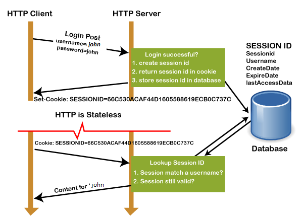

# Extra oefeningen


Deze oefeningen zijn extra oefen materiaal en zijn niet verplicht in te dienen op gitlab. Ze vormen een goede voorbereiding voor het examen of tussentijdse testen.


## DNA Match

**Deze oefening kan gemaakt worden met de kennis van Labo 2**

In deze opdracht ga je een functie schrijven die twee DNA sequenties met elkaar vergelijkt. De functie moet een percentage teruggeven dat aangeeft hoeveel procent van de sequenties overeenkomen.

```
const dnaMatch = (sequence1: string, sequence2: string): number => {
    
}
```

Vul de functie aan zodat ze werkt zoals beschreven in de opdracht.

* De functie moet een percentage teruggeven dat aangeeft hoeveel procent van de sequenties overeenkomen. Als de sequenties exact overeenkomen moet het percentage 100% zijn. Als de sequenties helemaal niet overeenkomen moet het percentage 0% zijn.
* De functie moet een exception werpen met de error message "**Sequences must be of equal length**" als de twee sequenties niet dezelfde lengte hebben.
* De functie moet een exception werpen met de error message "**Invalid character in sequence 1**" als de eerste sequentie niet alleen uit de letters A, T, C en G bestaat.&#x20;
* De functie moet een exception werpen met de error message "**Invalid character in sequence 2**" als de tweede sequentie niet alleen uit de letters A, T, C en G bestaat.&#x20;
* De functie moet een exception werpen met de error message "**Sequences must be of length > 0**" als 1 van de sequenties leeg is.

Dus bv:

```
dnaMatch("ATCG", "ATCG") // 100
dnaMatch("ATCG", "ATCC") // 75
dnaMatch("ATCG", "GCTA") // 0
dnaMatch("ATCG", "ATCCG") // Exception: Sequences must be of equal length
```

Zorg voor een console applicatie die de gebruiker vraagt om twee DNA sequenties in te voeren. De error messages moeten worden opgevangen en de gebruiker moet opnieuw gevraagd worden om de sequenties in te voeren. Als de sequenties geldig zijn moet het percentage worden weergegeven.

<figure><figcaption></figcaption></figure>

## Containers met vloeistof

**Deze oefening kan gemaakt worden met de kennis van Labo 2**

In deze opdracht ga je een aantal functies schrijven die werken met containers die vloeistof bevatten.

```
interface Container {
    label: string;
    maxCapacity: number;
    currentLevel: number;
    fluidType: string;
}

const createContainer = (label: string, beginLevel: number, maxCapacity: number, fluidType: string): Container => {
    
}

const fillContainer = (container: Container, amount: number, fluidType: string) => {
    
}

const emptyContainer = (container: Container, amount: number) => {
    
}

const printContainer = (container: Container) => {
    
}
```

Vul de functies aan zodat ze werken zoals beschreven in de opdracht.

* `createContainer` maakt een nieuw container object aan met de gegeven eigenschappen. Er zijn een aantal fouten die je moet opvangen:
  * Als de beginLevel groter is dan de maxCapacity wordt er een exception geworpen met de error message "Container overflow"
  * Als je een negatieve maxCapacity meegeeft wordt er een exception geworpen met de error message "Max capacity must be positive"
  * Als je een ongeldige fluidType meegeeft wordt er een exception geworpen met de error message "Invalid fluid type". De enige geldige types zijn "RED", "GREEN" en "BLUE"
* `fillContainer` vult de container met een bepaalde hoeveelheid vloeistof. Er zijn een aantal fouten die je moet opvangen:
  * Als je een negatieve hoeveelheid vloeistof probeert toe te voegen wordt er een exception geworpen met de error message "Container level must be positive"
  * Als je een ongeldige fluidType meegeeft wordt er een exception geworpen met de error message "Invalid fluid type". De enige geldige types zijn "RED", "GREEN" en "BLUE"
  * Als je een container probeert te vullen met een vloeistof die niet overeenkomt met de vloeistof die er al in zit wordt er een exception geworpen met de error message "This container does not allow this type of fluid"
  * Als je een container probeert te vullen met een hoeveelheid vloeistof die de maxCapacity overschrijdt wordt er een exception geworpen met de error message "Container overflow"
* `emptyContainer` haalt een bepaalde hoeveelheid vloeistof uit de container. Er zijn een aantal fouten die je moet opvangen:
  * Als je een negatieve hoeveelheid vloeistof probeert te verwijderen wordt er een exception geworpen met de error message "Amount must be positive"
  * Als je een container probeert te legen met een hoeveelheid vloeistof die de currentLevel overschrijdt wordt er een exception geworpen met de error message "Container underflow"
* `printContainer` print de container in de volgende vorm: "label: currentLevel/maxCapacity (fluidType)". Bijvoorbeeld: "Container 1: 5/10 (RED)"

Zorg ervoor dat je de functies test met verschillende waarden. Zorg er ook voor dat je de functies test met waarden die fouten moeten opleveren.

## Getallenlijst

**Deze oefening kan gemaakt worden met de kennis van Labo 2**

In deze opdracht is het de bedoeling om een aantal getallen aan de gebruiker te vragen en deze in een array op te slaan. Als de gebruiker klaar is met invoeren van de getallen moet deze gevalideerd worden volgens de volgende regels:

* De array mag niet leeg zijn. Als de array leeg is moet er een exception geworpen worden met de error message "**Array must contain at least one number**"
* Alle getallen in de array moeten groter zijn dan 0. Als er een getal kleiner of gelijk aan 0 in de array zit moet er een exception geworpen worden met de error message "**Array must contain only positive numbers**"
* Alle getallen in de array moeten uniek zijn. Als er een getal dubbel in de array zit moet er een exception geworpen worden met de error message "**Array must contain only unique numbers**"
* Alle elementen van de array moeten getallen zijn. Als er een element in de array zit dat geen getal is moet er een exception geworpen worden met de error message "**Array must contain only numbers**"
* De getallen moeten in oplopende volgorde staan. Als de getallen niet in oplopende volgorde staan moet er een exception geworpen worden met de error message "**Array must contain numbers in ascending order**"

Als de array voldoet aan alle regels moet er op het scherm worden weergegeven "Array is valid.".&#x20;

De validatie moet gebeuren in een aparte functie "validateArray" met de volgende signature:

```
const validateArray = (array: string[]): void => {
    
}
```

<figure><figcaption></figcaption></figure>

## Time between

**Deze oefening kan gemaakt worden met de kennis van Labo 2**

In deze opdracht ga je een functie schrijven die het aantal minuten berekent tussen twee tijdstippen. De functie moet de volgende signature hebben:

```
const calculateMinutesBetween = (hour1: string, minute1: string, hour2: string, minute2: string ): number => {
    
}
```

Vul de functie aan zodat ze werkt zoals beschreven in de opdracht en zorg voor de volgende validatie:

* De functie moet een exception werpen als een van de parameters geen getal is. De error message moet aangeven welke parameter geen getal is. bv: "hour \[from] must be a number"
* De functie moet een exception werpen als een van de parameters een negatief getal is. De error message moet aangeven welke parameter een negatief getal is. bv: "minute \[from] must be a positive number"
* De functie moet een exception werpen als een van de parameters geen twee cijfers bevat. De error message moet aangeven welke parameter geen twee cijfers bevat. bv: "hour \[to] should have two digits"
* De functie moet een exception werpen als het uur niet tussen 00 en 24 ligt. De error message moet aangeven welk uur niet tussen 00 en 24 ligt. bv: "hour \[from] must be between 00 and 24"
* De functie moet een exception werpen als de minuten niet tussen 00 en 60 ligt. De error message moet aangeven welke minuten niet tussen 00 en 59 ligt. bv: "minute \[from] must be between 00 and 60"
* De functie moet een exception werpen met de error message "the first timestamp should be before the second" als de eerste timestamp later is dan de tweede.

Als de parameters voldoen aan alle regels moet de functie het aantal minuten teruggeven tussen de twee tijdstippen.

Blijf de functie herhalen tot de gebruiker een geldige invoer heeft gegeven.

Zorg voor een zo kort mogelijke oplossing. Als je bepaalde code meerdere keren gebruikt kan je deze in een aparte functie zetten.

<figure><figcaption></figcaption></figure>

## Paardensprong

In deze opdracht ga je een functie schrijven die nagaat of een paard op een bepaalde positie op het schaakbord kan bewegen naar een andere positie.&#x20;

Vooraleer we beginnen een beetje context over het schaakbord:

### **Het bord**

Elk veld wordt aangeduid door een combinatie van kolomnummer (col) en rijnummer (row). Bij het verwijzen naar een veld geven we steeds eerst het kolomnummer door en dan pas het rijnummer.

De kolom helemaal links heeft kolomnummer 1, de kolom helemaal rechts heeft kolomnummer 8.

De rij helemaal onderaan heeft rijnummer 1, de rij helemaal bovenaan heeft rijnummer 8.

********

### **Geldige zetten paard**

Het paard beweegt zich - in een geldige zet - ofwel twee horizontale velden en één verticaal veld, ofwel twee verticale velden en één horizontaal veld (een L-vorm).

.png>)

### Implementatie

Schrijf een functie met de volgende signature:

```
const checkKnightMove = (col: number, row: number, colTo: number, rowTo: number): void => {
    
}
```

De functie moet voldoen aan de volgende regels:

* De functie moet een exception gooien wanneer een van de parameters buiten het spelbord valt.
* De functie moet een exception gooien wanneer de meegegeven parameters geen geldige zet vormen.
* Als de meegegeven parameters een geldige zet vormen moet de functie "Valid move" op het scherm weergeven.

Maak een kleine console applicatie waarin je de functie interactief (via readline-sync) kan testen.

### Voorbeeldinteractie

```
Enter column: 1
Enter row: 1
Enter column to: 3
Enter row to: 2
Valid move
```

```
Enter column: 1
Enter row: 1
Enter column to: 3
Enter row to: 3
ERROR: Invalid move
```

```
Enter column: 1
Enter row: 1
Enter column to: 9
Enter row to: 2
ERROR: Out of bounds
```
