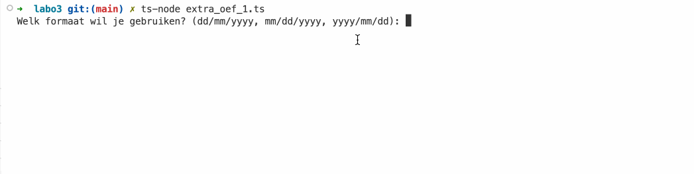
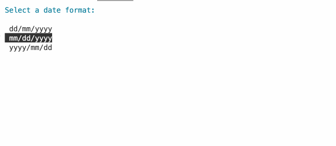

# Extra oefeningen


Deze oefeningen zijn extra oefen materiaal en zijn niet verplicht in te dienen op gitlab. Ze vormen een goede voorbereiding voor het examen of tussentijdse testen.


## Filter

### Deel 1

Schrijf een functie `filterPositive` die een array van getallen als parameter verwacht. De functie `filterPositive` moet een nieuwe array teruggeven met enkel de positieve getallen uit de array die als parameter werd meegegeven. Deze functie **MOET** aan de hand van een **`for`-loop** geschreven worden en mag **geen** gebruik maken van de **ingebouwde functie `filter` van een array**.

Roep de functie `filterPositive` aan met de volgende array als parameter:

```typescript
const numbers: number[] = [-4,-4,1,2,3,4,5];
console.log(filterPositive(numbers)); // 1,2,3,4,5
```

### Deel 2

Schrijf een functie `filterNegative` die een array van getallen als parameter verwacht. De functie `filterNegative` moet een nieuwe array teruggeven met enkel de negatieve getallen uit de array die als parameter werd meegegeven.

Roep de functie `filterNegative` aan met de volgende array als parameter:

```typescript
const numbers: number[] = [-4,-4,1,2,3,4,5];
console.log(filterNegative(numbers)); // -4,-4
```

### Deel 3

Schrijf een functie `filterEven` die een array van getallen als parameter verwacht. De functie `filterEven` moet een nieuwe array teruggeven met enkel de even getallen uit de array die als parameter werd meegegeven.

Roep de functie `filterEven` aan met de volgende array als parameter:

```typescript
const numbers: number[] = [-4,-4,1,2,3,4,5];
console.log(filterEven(numbers)); // -4,-4,2,4
```

### Deel 4

Schrijf nu een functie `filter` die een array van getallen als eerste parameter verwacht en een functie als tweede parameter. De functie `filter` moet een nieuwe array teruggeven met enkel de getallen uit de array die als eerste parameter werd meegegeven waarvoor de functie die als tweede parameter werd meegegeven `true` teruggeeft.

Herschrijf de functies `filterPositive`, `filterNegative` en `filterEven` door gebruik te maken van de functie `filter`.

Voorbeeld van gebruik:

```typescript
const numbers: number[] = [-4,-4,1,2,3,4,5];
const isPositive = (number: number) => number >= 0;
console.log(filter(numbers, isPositive)); // 1,2,3,4,5
```

## Date formatter

Schrijf de volgende functies die een datum omzetten naar een string. Deze functies moeten de volgende interface implementeren:

```typescript
interface DateFormatter {
    (date: Date): string
}
```

* de functie `ddmmyyyFormatter` die een datum omzet naar een string in het formaat `dd/mm/yyyy`
* de functie `mmddyyyFormatter` die een datum omzet naar een string in het formaat `mm/dd/yyyy`
* de functie `yyyymmddFormatter` die een datum omzet naar een string in het formaat `yyyy/mm/dd`
* de functie `hhmmssFormatter` die een datum omzet naar een string in het formaat `hh:mm:ss`

Schrijf een functie `welcome` die een datum als parameter verwacht, een `DateFormatter` functie voor de datum en een `DateFormatter` functie voor de tijd. De functie `welcome` moet de volgende tekst op het scherm tonen:

```
Welcome, today is dd/mm/yyyy - hh:mm:ss
```

Vraag aan de gebruiker welke datumformaat hij wil gebruiken. De gebruiker kan kiezen tussen `dd/mm/yyyy`, `mm/dd/yyyy` en `yyyy/mm/dd`. Na de keuze van de gebruiker moet de functie `welcome` elke seconde opnieuw aangeroepen worden met de huidige datum en het gekozen datumformaat. Als de gebruiker een ongeldig datumformaat ingeeft, moet de gebruiker opnieuw gevraagd worden om een datumformaat in te geven.

<figure><figcaption></figcaption></figure>

### Uitbreiding (PRO)

Installeer de npm package `terminal-kit` en gebruik deze om de volgende uitbreidingen te maken:

* Zorg ervoor dat het datum formaat wordt gekozen aan de hand van een menu. Gebruik hiervoor de functie `singleColumnMenu`.
* Zorg ervoor dat de welkomst tekst altijd op positie 1,1 wordt getoond van het terminal venster en dat het scherm altijd wordt gecleard vooraleer de tekst wordt getoond. Je kan hiervoor de functies `moveTo` en `clear` gebruiken.
* Zorg ervoor dat de applicatie wordt afgesloten als de gebruiker op de `x` toets drukt. Je kan hier de functie `grabInput` en `on` van `terminal-kit` voor gebruiken. Het programma sluiten doe je met de functie `process.exit()`.
* Zorg ervoor dat de kleur van de tekst verandert als je op de `c` toets drukt. Je kan hiervoor de functie `color` van `terminal-kit` gebruiken. Hij zal wisselen tussen de volgende kleuren: `red`, `green`, `blue`, `yellow`, `magenta` en`cyan`.

<figure><figcaption></figcaption></figure>

## Random Generator

Schrijf een functie `generateRandomNumbers` die een interval als eerste parameter verwacht en een callback functie als tweede parameter. De functie `generateRandomNumbers` moet elke `interval` milliseconden een willekeurig getal tussen 0 en 100 genereren en deze doorgeven aan de callback functie die als tweede parameter werd meegegeven.

Roep de functie `generateRandomNumbers` aan met een interval van 1000 milliseconden en een callback functie die het gegenereerde getal op het scherm toont. Geef duidelijk aan welke generator het getal heeft gegenereerd (bv "Generator 1: 42").

Roep de functie `generateRandomNumbers` nogmaals aan met een interval van 2500 milliseconden en een andere callback functie die het gegenereerde getal op het scherm toont. Geef duidelijk aan welke generator het getal heeft gegenereerd (bv "Generator 2: 32").

### Voorbeeldinteractie

```
Generator 1: 65
Generator 1: 93
Generator 2: 9
Generator 1: 32
Generator 1: 98
Generator 2: 79
Generator 1: 73
```
