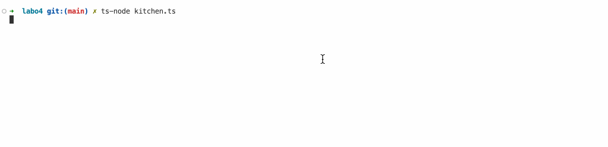
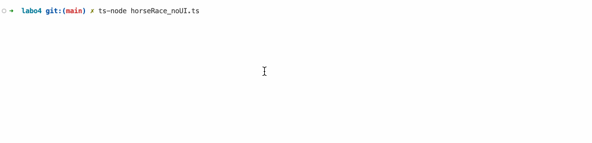
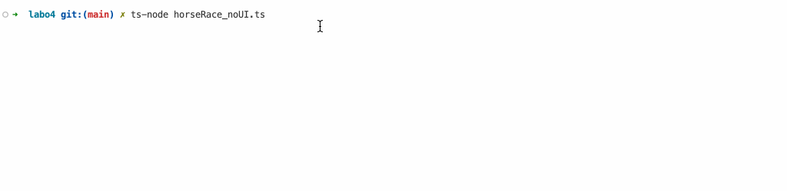
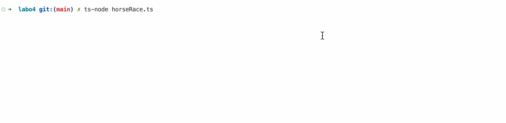

# Extra oefeningen

## Numbers API

Gebruik de [Numbers API](http://numbersapi.com/) om een applicatie te schrijven die een getal vraagt aan de gebruiker en vervolgens een feit over dat getal print.

`http://numbersapi.com/15?json`

Gebruik fetch om de data op te halen. Doe dit op twee manieren:

* met een `then` chain
* met `async` en `await`

#### Gebruikersinteractie

```
Geef een getal: 15
Feit: 15 is the number of years that the average American spends watching television.
```

## Wait functie

In deze oefening gaan we een wait functie schrijven die een `Promise` teruggeeft. Deze `Promise` wordt resolved na een bepaalde tijd. Zo kunnen we een programma laten wachten voor een bepaalde tijd.

De functie `wait` heeft één parameter: `ms`. Deze parameter bepaalt hoe lang de applicatie moet wachten. De functie geeft een `Promise` terug die resolved wordt na `ms` milliseconden.

```typescript
const wait = (ms: number): Promise<void> => {
    // ...
}
```

Gebruik de functie `wait` om een applicatie te schrijven die 5 seconden wacht en dan een melding print.

## Potato Promise

<figure><figcaption></figcaption></figure>

We beginnen met onderstaande code. Deze code simuleert het koken van aardappelen. De functie `makeMashedPotatoes` heeft twee parameters: `food` en `callback`. De parameter `food` bevat de aardappelen die gekookt moeten worden. De parameter `callback` bevat een functie die aangeroepen wordt als de aardappelen klaar zijn. De functie `makeMashedPotatoes` kookt de aardappelen en roept de callback functie op als de aardappelen klaar zijn.

```typescript
interface Food {
    name: string;
}

interface FoodReadyCallback {
    (food: Food): void;
}

const makeMashedPotatoes = (food: Food, callback: FoodReadyCallback) => {
    console.log("Peeling potatoes");
    food.name = "peeled potatoes";
    setTimeout(() => {
        console.log("Cutting potatoes");
        food.name = "cut potatoes";
        setTimeout(() => {
            console.log("Boiling potatoes");
            food.name = "boiled potatoes";
            setTimeout(() => {
                console.log("Mashing potatoes");
                food.name = "mashed potatoes";
                callback(food);
            }, 1000);
        }, 1000);
    }, 1000);
}

makeMashedPotatoes({ name: "potatoes" }, (food) => {
    console.log("Food is ready: " + food.name);
});
```

Herschrijf deze functie zodat we geen callback functie meer gebruiken maar een `Promise`. De functie `makeMashedPotatoes` moet een `Promise` teruggeven die resolved wordt als de aardappelen klaar zijn. De `Promise` moet de aardappelen bevatten die klaar zijn.

## Asynchronous Potato

Ga verder met de voorgaande oefening. Herschrijf de functie `makeMashedPotatoes` zodat deze gebruik maakt van `async` en `await`. Je kan de functie `wait` gebruiken die je in de vorige oefening geschreven hebt om de nodige wachttijden te simuleren. Je mag in de `makeMashedPotatoes` functie geen `setTimeout` meer gebruiken en er mag geen callback functie meer gebruikt worden.

Tip: vermijd de 'callback hell'

## Oven

In deze oefening gaan we een oven simuleren. De oven heeft een temperatuur en een timer. De oven kan opgewarmd worden tot een bepaalde temperatuur en een timer kan ingesteld worden. De oven kan ook afgekoeld worden. Na het afkoelen is de oven uitgeschakeld.

<figure><figcaption></figcaption></figure>

### Opgave

We beginnen met de interface van de oven. Deze interface bevat de volgende eigenschappen:

* `degrees`: de temperatuur van de oven
* `targetDegrees`: de temperatuur waar de oven naar toe moet
* `timer`: de timer van de oven
* `maxDegrees`: de maximale temperatuur van de oven

Maak een variabele `oven` aan van het type `Oven`. De oven heeft een temperatuur van 0 graden, een timer van 0 seconden en begint met een targetDegrees van 0 graden. De maximale temperatuur van de oven is 200 graden.

#### StartPreheat

Schrijf een functie `startPreheat` die de oven opwarmt tot een bepaalde temperatuur. De functie heeft twee parameters: `oven` en `targetDegrees`. De functie geeft een `Promise` terug die de oven bevat. De oven moet elke seconde de temperatuur verhogen met 10 graden. Als de oven de target temperatuur bereikt, moet de `Promise` resolved worden en een melding geprint worden dat de oven klaar is. Als de oven boven de 200 graden komt, moet de `Promise` rejected worden en een melding geprint worden dat de oven niet boven de 200 graden kan komen.

De signature van de functie is als volgt:

```typescript
function startPreheat(oven: Oven, targetDegrees: number): Promise<Oven> {
    // ...
}
```

#### StartTimer

Schrijf een functie `startTimer` die de timer van de oven opstart. De functie heeft twee parameters: `oven` en `timer`. De functie geeft een `Promise` terug die de oven bevat. De oven moet elke seconde de timer verhogen met 1 seconde. Als de oven de target timer bereikt, moet de `Promise` resolved worden en een melding geprint worden dat de timer klaar is. Als de oven 0 graden is, moet de `Promise` rejected worden en een melding geprint worden dat de oven niet kan opwarmen als hij 0 graden is.

Voor deze functie moet je zelf de signature bepalen.

#### CoolDown

Schrijf een functie `coolDown` die de oven afkoelt. De functie heeft één parameter: `oven`. De functie geeft een `Promise` terug die de oven bevat. De oven moet elke seconde de temperatuur verlagen met 10 graden. Als de oven 0 graden is, moet de `Promise` resolved worden en een melding geprint worden dat de oven is afgekoeld. Als de oven onder 0 graden komt, moet de `Promise` rejected worden en een melding geprint worden dat de oven niet onder 0 graden kan komen.

Voor deze functie moet je zelf de signature bepalen.

#### Gebruik

Gebruik deze functies op twee verschillende manieren:

* Gebruik promise chaining om de oven op te warmen, de timer te starten en de oven af te koelen. Als er een fout optreedt, moet de fout afgehandeld worden.
* Gebruik `async/await` om de oven op te warmen, de timer te starten en de oven af te koelen. Als er een fout optreedt, moet de fout afgehandeld worden.

<figure><figcaption></figcaption></figure>

Als uitbreiding kan je deze oefening ook oplossen met callbacks. Je kan hiervoor de functies `startPreheatWithCallback`, `startTimerWithCallback` en `coolDownWithCallback` gebruiken. Deze functies hebben dezelfde signature als de functies `startPreheat`, `startTimer` en `coolDown`, maar gebruiken callbacks in plaats van promises.

## WaitFor functie

In deze oefening gaan we een waitFor functie schrijven die een `Promise` teruggeeft. Deze `Promise` wordt resolved als een bepaalde conditie waar is. Zo kunnen we een programma laten wachten tot een bepaalde conditie waar is. Deze functie moet elke 100ms controleren of de conditie waar is. Als de conditie waar is, wordt de `Promise` resolved. Als de timeout overschreden wordt, wordt de `Promise` rejected. De functie `waitFor` kan je gebruiken om te wachten tot een bepaalde conditie waar is.

```typescript
interface ConditionCheck {
    (): boolean;
}

const waitFor = (condition: ConditionCheck, timeout: number): Promise<void> => {
    // ..
}
```

Zoek een manier om deze functie te testen.&#x20;

## Look at my horse

In deze oefening gaan we een paardenrace simuleren. Je begint van de volgende interface:

```typescript
interface Horse {
    track: number;
    name: string;
    position: number;
}
```

Deze interface bevat de volgende eigenschappen:

* `track`: het nummer van de baan waarop het paard loopt
* `name`: de naam van het paard
* `position`: de positie van het paard op de baan

Schrijf een functie `runHorse` die een paard laat lopen. De functie heeft één parameter: `horse`. De functie geeft een `Promise` terug die het paard bevat met de nieuwe positie. Het paard moet elke seconde een stukje lopen (gebruik setInterval). Hoeveel het paard moet vooruit gaan wordt telkens willekeurig bepaald. Als het paard de finish bereikt, moet de `Promise` resolved worden en een melding geprint worden dat het paard de finish bereikt heeft. De finish is bereikt als de positie van het paard 100 is.

### Promise.all

Maak nu een array aan met drie paarden (A,B en C). Gebruik `Promise.all` om de drie promises tegelijk te starten en te wachten tot ze allemaal klaar zijn. Als alle paarden de finish bereikt hebben, moet er een melding geprint worden dat alle paarden de finish bereikt hebben.

<figure><figcaption></figcaption></figure>

### Promise.race

Gebruik ook `Promise.race` om te wachten tot één paard de finish bereikt. Als een paard de finish bereikt, moet er een melding geprint worden welk paard gewonnen heeft.

<figure><figcaption></figcaption></figure>

### Horse Terminal (PRO)

Gebruik de `terminal-kit` library om de paarden race te visualiseren in de terminal.

<figure><figcaption></figcaption></figure>

