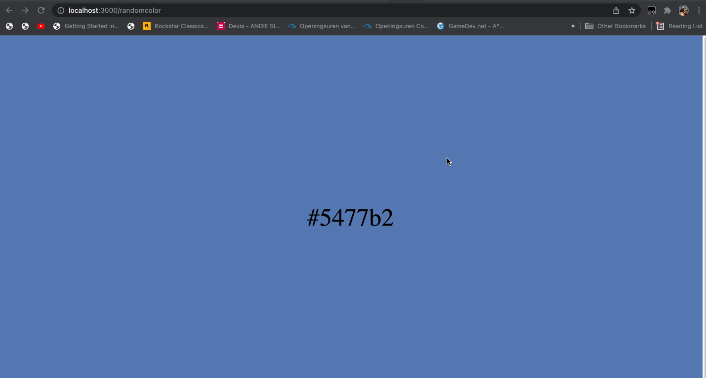

# Labo 5

## helloExpress

We bouwen in deze oefening onze eerste **express** applicatie. Hier onder vind je een overzicht over alle routes die deze applicatie moet aanbieden en wat ze allemaal moeten doen.

Zorg ervoor dat deze applicatie in een aparte map `helloExpress` staat. Maak een `package.json` aan en installeer de nodige packages.


In deze oefening is het nog niet de bedoeling om EJS te gebruiken. We gaan enkel HTML pagina's of json terugsturen.


**http://localhost:3000**

* Zorg dat `localhost:3000` een html pagina stuurt waarin je een header met de titel van jouw applicatie (kies zelf iets) met een kleine paragraaf die een beschrijving geeft.

**http://localhost:3000/whoami & http://localhost:3000/whoamijson**

*   Maak een globale variabele aan `thisisme` die een object bevat met 3 properties:

    * `name`
    * `age`
    * `profilePic`

    De `profilepic` property bevat een url van een online foto (kies zelf iets)
* Zorg dat `localhost:3000/whoami` een HTML pagina toont met:
  * de zin "My name is _XXX_ and I am _YYY_ years old" met XXX en YYY de waarden van de properties van de `thisisme` variabel en
  * de foto uit profilePic
* Zorg dat `localhost:3000/whoamijson` de inhoud van `thisisme` stuurt als JSON.


Test met curl -v dat de content-type correct is!


**http://localhost:3000/pikachujson & http://localhost:3000/pikachuhtml**

* Doe een API call naar [https://pokeapi.co](https://pokeapi.co) om de data van Pikachu op te halen en steek die in een globale variabel `pikachu`.
* Zorg dat `localhost:3000/pikachujson` de data van `pikachu` als JSON terugstuurt
* Zorg dat `localhost:3000/pikachuhtml` een mooie pikachu HTML pagina toont. Deze moet de volgende zaken zeker bevatten:
  * de naam
  * id
  * gewicht
  * een image van Pikachu's voorkant (zie sprites)
  * een image van Pikachu's achterkant (zie sprites)

**http://localhost:3000/randomcolor**

* Deze route toont elke keer dat je deze pagina bezoekt een andere kleur.
* Zoek zelf uit hoe je een willekeurige kleur kan berekenen. Probeer zelf eerst iets in elkaar te steken voor je begint te googlen hoe het moet.

**Foutafhandeling**

Zorg voor een eigen ontworpen 404 pagina die getoond wordt als de gebruiker een route probeert te bezoeken die niet bestaat.
