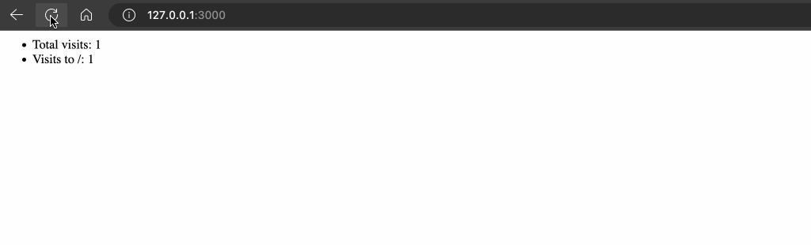

# Extra oefeningen

ViewCounter

### Opdracht

Maak een webserver in express die telkens een pagina teruggeeft met het totaal aantal bezoeken (globaal) en het aantal bezoeken per pad.

Je moet dus een globale teller bijhouden en een teller per pad (bv door een object te gebruiken dat als key het pad heeft en als value het aantal views). Bij het herstarten van de server mogen de tellers opnieuw op 0 gezet worden.

### Voorbeeldinteractie

<figure><figcaption></figcaption></figure>
