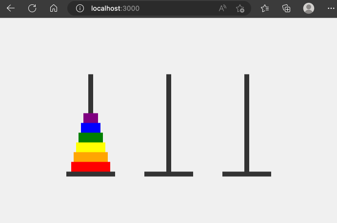

# Extra oefeningen

## Extra oefeningen

### Rekenwonder

In deze opgave gaan we een oefenprogramma schrijven voor leerlingen van het 2de studiejaar. Het programma zal de leerlingen helpen bij het oefenen van de tafels van vermenigvuldiging en deling. De leerling zal willekeurig twee getallen tussen 0 en 10 krijgen en zal de uitkomst moeten ingeven. Het programma zal de leerling laten weten of het antwoord correct is of niet. Het programma zal ook bijhouden hoeveel vragen de leerling correct heeft beantwoord.

#### Begin situatie

Je kan voor deze opgave starten met de volgende html/css broncode:

```html
<!DOCTYPE html>
<html>
    <head>
        <title>Rekenwonder</title>
        <link rel="stylesheet" href="/css/style.css" />
    </head>
    <body>
        <section class="container">
            <section class="feedback">
                The answer is 10 and your answer is 1. Correct!
            </section>
            <form class="math-form" method="post">
                <input type="number" name="number1" value="4" class="num1" readonly />
                <input type="hidden" name="operator" value="/" />
                <span class="operator">
                    
                </span>
                <input type="number" name="number2" value="7" class="num1" readonly />
                <span class="equals">
                    
                </span>
                <input type="number" name="result" value="0" class="result" />
                <input type="submit" value="Check" class="check" />
            </form>
            <div class="score">
                1 of 1 correct.
            </div>
        </div>
    </body>
</html>
```

en de volgende css:

```css
body {
    margin: 0;
    padding: 0;
    font-family: 'Roboto', sans-serif;
}

.container {
    display: flex;
    justify-content: center;
    align-items: center;
    flex-direction: column;
    height: 100vh;
    background: linear-gradient(to bottom right, #ff758c, #ff7eb3, #8b78ff);
}

.math-form {
    display: flex;
    flex-direction: row;
    justify-content: center;
    align-items: center;
    background-color: #fff;
    border-radius: 10px;
    padding: 30px;
    position: relative;
    padding-bottom: 80px;
}

.math-form input[type="number"] {
    width: 100px;
    height: 50px;
    background-color: #f5f5f5;
    font-size: 36px;
    font-weight: bold;
    text-align: center;
    border: none;
    border-radius: 10px;
    color: #ff758c;
}

.math-form .operator {
    font-size: 36px;
    font-weight: bold;
    color: #ff7eb3;
    display: flex;
    justify-content: center;
    align-items: center;

}

.math-form .equals {
    font-size: 36px;
    font-weight: bold;
    color: #8b78ff;
}

.math-form .check {
    position: absolute; 
    bottom: 0;
    left: 0;
    width: 100%;
    height: 50px;
    font-size: 24px;
    background: #8b78ff;
    color: #fff;
    border: none;
    border-radius: 0 0 10px 10px;
    cursor: pointer;
}

.math-form img {
    margin-left: 10px;
    margin-right: 10px;
    width: 50px;
    height: 50px;
}

.feedback {
    color: white;
    text-shadow: 2px 2px #8b78ff;
    font-size: 22px;
    text-align: center;
    margin-bottom: 10px;
}

.score {
    color: white;
    text-shadow: 2px 2px #8b78ff;
    font-size: 22px;
    text-align: center;
    margin-top: 10px;
}
```

Afbeeldingen:

<div>

<figure><figcaption></figcaption></figure>

 

<figure><figcaption></figcaption></figure>

 

<figure><figcaption></figcaption></figure>

</div>

Deze pagina ziet er als volgt uit:

<figure><figcaption></figcaption></figure>

#### Stappenplan

**Express applicatie opzetten**

Maak een nieuw express project aan met de naam `rekenwonder` dat gebruik maakt van de `ejs` view engine. Installeer al de nodige dependencies. Zorg dat de server op de poort `3000` draait.

**EJS en statische bestanden**

Maak een ejs view voor deze opgave met de naam `index.ejs` en plaats de inhoud van de html hier in. Zorg ervoor dat de css en de afbeeldingen in een public folder staan en dat deze publiek toegankelijk zijn. Zorg ervoor dat deze pagina zichtbaar is op de root van je express applicatie (via een GET). Je moet in deze stap nog geen parameters doorgeven aan de ejs view.

**De parameters**

Zorg ervoor dat je de volgende parameters doorgeeft aan de ejs view:

* `timesCorrect`: het aantal keer dat de gebruiker correct heeft geantwoord. De variabele die je hier doorgeeft mag een globale variabele zijn.
* `timesWrong`: het aantal keer dat de gebruiker foutief heeft geantwoord. De variabele die je hier doorgeeft mag een globale variabele zijn.
* `feedback`: een string die feedback geeft over het laatste antwoord van de gebruiker. In het begin is dit `undefined`.
* `number1`: een willekeurig getal tussen 0 en 10
* `number2`: een willekeurig getal tussen 0 en 10
* `operator`: een willekeurig operator die kan zijn `*` of `/`

**Feedback**

Zorg ervoor dat de feedback wordt weergegeven in de ejs view. Als er geen feedback is, dan moet er geen feedback worden weergegeven. (Tip: gebruik een if statement in de ejs view)

**Score**

Zorg ervoor dat de score wordt weergegeven in de ejs view. De score is het aantal keer dat de gebruiker correct heeft geantwoord op het aantal keer dat de gebruiker heeft geantwoord.

**Het formulier**

Zorg dat de input velden van het formulier worden ingevuld met de juiste parameters. Zorg ervoor dat de gebruiker een antwoord kan geven door het formulier in te vullen en op de knop `Check` te klikken. Als de gebruiker op de knop `Check` klikt, dan moet de gebruiker worden doorgestuurd naar de root van de express applicatie (via een POST).

**De POST route**

Zorg ervoor dat de POST route de volgende stappen uitvoert:

* Eerst moet je de volgende parameters uit de request body halen: `number1`, `number2`, `operator` en `result`. Deze parameters worden doorgegeven door het formulier.
* Je berekent vervolgens het juiste antwoord aan de hand van de number parameters en de operator. Zorg ervoor dat je de juiste operator gebruikt. (bv: `*` of `/`)
* Je vergelijkt het juiste antwoord met het gegeven antwoord. Als het antwoord correct is, dan moet je de globale variabele `timesCorrect` met 1 verhogen. Als het antwoord foutief is, dan moet je de globale variabele `timesWrong` met 1 verhogen.
* Je bepaald vervolgens de feedback die je moet weergeven in de ejs view. Als het antwoord correct is, dan moet je de feedback `The answer is 5 and your answer is 5. Correct!` weergeven. Als het antwoord foutief is, dan moet je de feedback `The answer is 3 and your answer is 5. Wrong!` weergeven.
* Vervolgens bereken je opnieuw een nieuwe willekeurige oefening (nieuwe parameters die je doorgeeft aan de ejs view). Je gebruikt hiervoor dezelfde ejs view als bij de GET route maar je geeft wel een extra parameter mee: `feedback`. Deze parameter bevat de feedback die je hebt berekend in de POST route.

## Hanoi

In deze opgave gaan we een spelletje programmeren. Het spelletje is gebaseerd op het bekende spelletje [Hanoi](https://nl.wikipedia.org/wiki/Toren\_van\_Hanoi). Het spelletje bestaat uit 3 stokken en een aantal schijven. De schijven hebben verschillende diameters. Het doel van het spel is om alle schijven van de eerste stok naar de laatste stok te verplaatsen. Je mag echter maar 1 schijf tegelijk verplaatsen en een schijf mag enkel op een andere schijf geplaatst worden als de diameter van de schijf die je wil verplaatsen kleiner is dan de diameter van de schijf waar je hem op wil plaatsen.

In deze opgave maken we gebruik van 3 stokken en 6 schijven.

### Begin situatie

We hebben een HTML pagina gekregen waarin we de begin situatie van het spelletje kunnen zien. De HTML pagina bevat een aantal elementen die we nodig hebben om het spel te kunnen programmeren.

```html
<!DOCTYPE html>
<html lang="en">
<head>
    <meta charset="UTF-8">
    <meta http-equiv="X-UA-Compatible" content="IE=edge">
    <meta name="viewport" content="width=device-width, initial-scale=1.0">

    <link rel="stylesheet" href="/css/styles.css" />
    <title>Hanoi</title>
</head>
<body>
    <div class="container">
            <div class="pole pole0" id="pole-0" onclick="onClick('0')">
                    <div class="disk disk-0"></div>
                    <div class="disk disk-1"></div>
                    <div class="disk disk-2"></div>
                    <div class="disk disk-3"></div>
                    <div class="disk disk-4"></div>
                    <div class="disk disk-5"></div>  
            </div>
            <div class="pole pole1" id="pole-1" onclick="onClick('1')">  
            </div>
            <div class="pole pole2" id="pole-2" onclick="onClick('2')">
            </div>
    </div>   
    <script src="/js/hanoi.js"></script>
</body>
</html>
```

en het volgende javascript bestand:

```js
let fromPole = null;
let toPole = null;

function onClick(poleid) {
    if (fromPole === null) {
        fromPole = poleid;
    } else {
        toPole = poleid;
        document.location.search = `from=${fromPole}&to=${toPole}`;
    }
    document.getElementById("pole-" + poleid).classList.add('selected');
}
```

en de volgende CSS:

```css
* {
    box-sizing: border-box;
    margin: 0;
    padding: 0;
}
.container {
    display: flex;
    justify-content: center;
    align-items: center;
    height: 100vh;
    background-color: #f0f0f0;
}
.pole {
    width: 10px;
    height: 200px;
    background-color: #333;
    position: relative;
    align-items: center;
    display: flex; /* added this */
    flex-direction: column-reverse; /* added this */
}

.selected {
    background-color: #f00;
}

.pole1 {
    margin-left: 150px
}

.pole2 {
    margin-left: 150px
}

.pole::before {
    content: "";
    width: 100px;
    height: 10px;
    background-color: #333;
    position: absolute;
    bottom: -10px;
    left: -45px;
}

.disk {
    height: 20px;
}

.disk-0 {
    width: 80px;
    background-color: #ff0000;
}

.disk-1 {
    width: 70px;
    background-color: #ffa500;
}

.disk-2 {
    width: 60px;
    background-color: #ffff00;
}

.disk-3 {
    width: 50px;
    background-color: #008000;
}

.disk-4 {
    width: 40px;
    background-color: #0000ff;
}

.disk-5 {
    width: 30px;
    background-color: #800080;
}

.error {
    position: fixed;
    top: 0;
    left: 0;
    width: 100%;
    background-color: rgba(255, 54, 54, 0.89);
    color: #fff;
    padding: 10px;
    text-align: center;
    z-index: 1000;
    font-family: "Roboto", sans-serif;
    font-size: 18px;
    box-shadow: 0 4px 8px rgba(0,0,0,0.2);
}

.success {
    position: fixed;
    top: 0;
    left: 0;
    width: 100%;
    background-color: rgb(43, 228, 43);
    color: #fff;
    padding: 10px;
    text-align: center;
    z-index: 1000;
    font-family: "Roboto", sans-serif; 
    font-size: 18px; 
    box-shadow: 0 4px 8px rgba(0,0,0,0.2); 
}
```

Probeer de HTML pagina te openen in je browser. Je ziet dat er 3 stokken zijn met 6 schijven. De schijven zijn op de eerste stok geplaatst. De schijven zijn oplopend van grootte. De grootste schijf staat onderaan en de kleinste schijf staat bovenaan. Probeer de schijven te verplaatsen door de HTML pagina aan te passen, zorg ervoor dat je de structuur van de HTML goed begrijpt.

### Express app

Maak een nieuwe express applicatie aan en zorg ervoor dat de HTML pagina die je hierboven ziet in de browser te zien is als je naar de root van je applicatie navigeert. De CSS bestanden moeten ook beschikbaar zijn. Gebruik hiervoor ejs om de HTML pagina te renderen.

### Schijven

Maak een array die de beginsituatie van de schijven voorstelt. De array bevat 3 arrays. De eerste array bevat de schijven die op de eerste stok staan. De tweede array bevat de schijven die op de tweede stok staan. De derde array bevat de schijven die op de derde stok staan. De schijven zijn oplopend van grootte. De grootste schijf staat onderaan en de kleinste schijf staat bovenaan.

```typescript
let hanoi: number[][] = [[0,1,2,3,4,5],[],[]];
```

Geef de `hanoi` array mee aan de ejs template. In de ejs template kan je de array gebruiken om de schijven te renderen. De schijven moeten op de juiste plaats in de HTML pagina geplaatst worden. De schijven moeten ook op de juiste plaats in de array geplaatst worden. Gebruik hiervoor de for loop in de ejs template.

Experimenteer met de array en de ejs template om te zien hoe je de schijven kan renderen.

### Schijf verplaatsen

Als je de JavaScript code beter bekijkt dan zie je de lijn

```
    document.location.search = `from=${fromPole}&to=${toPole}`;
```

Deze lijn zorgt ervoor dat de browser een nieuwe pagina laadt. De nieuwe pagina wordt geladen met de query parameters `from` en `to`. De query parameters bevatten de stokken waar de schijf vandaan komt en waar de schijf naartoe moet. De query parameters worden gebruikt om de schijf te verplaatsen.

Pas nu je express applicatie aan zodat je deze query parameters kan gebruiken om de schijf te verplaatsen. De schijf moet verplaatst worden in de array. Je haalt dus een schijf uit de array van de stok waar de schijf vandaan komt (via pop) en je plaatst de schijf in de array van de stok waar de schijf naartoe moet (via push).

Je moet in dit deel nog niet controleren of de schijf verplaatst mag worden. Je mag ervan uitgaan dat de gebruiker de schijven op de juiste manier verplaatst.

### Winnaar

Als de gebruiker alle schijven op de laatste stok heeft geplaatst dan heeft de gebruiker gewonnen. Zorg ervoor dat de gebruiker een bericht krijgt als hij alle schijven op de laatste stok heeft geplaatst. Je kan dit doen door een success bericht door te geven aan de ejs template. In de ejs template kan je dan een bericht tonen als de gebruiker gewonnen heeft.

Je kan nagaan of de gebruiker gewonnen heeft door te kijken of de laatste array in de `hanoi` array 6 schijven bevat.

<figure><figcaption><p>We kijken nog niet na of de blokken mogen verplaatst worden.</p></figcaption></figure>

### Validatie

Niet elke schijf mag op elke schijf geplaatst worden. De grootste schijf mag niet op een kleinere schijf geplaatst worden. De schijf die je wil verplaatsen moet bovenaan staan op de stok waar de schijf vandaan komt. De schijf die je wil verplaatsen moet bovenaan staan op de stok waar de schijf naartoe moet.

Je kan dit doen door na te gaan dat elk getal in de array in de juiste volgorde staat. Bijvoorbeeld:

Juiste volgorde:

```typescript
let hanoi = [[0,1,2,3,4,5],[],[]];
```

Foute volgorde (4 moet voor 5 staan)

```typescript
let hanoi = [[0,1,2,3],[5,4],[]];
```

Foute volgorde (1 moet voor 2 staan)

```typescript
let hanoi = [[0,2,1,3,5],[],[4]];
```

Als de schijf niet verplaatst mag worden dan moet je een foutmelding tonen. Je kan dit doen door een error variabele mee te geven aan de ejs template. De error variabele bevat een string met de foutmelding. De ejs template kan deze string tonen in een HTML element met de class `error`.

<figure><figcaption></figcaption></figure>
