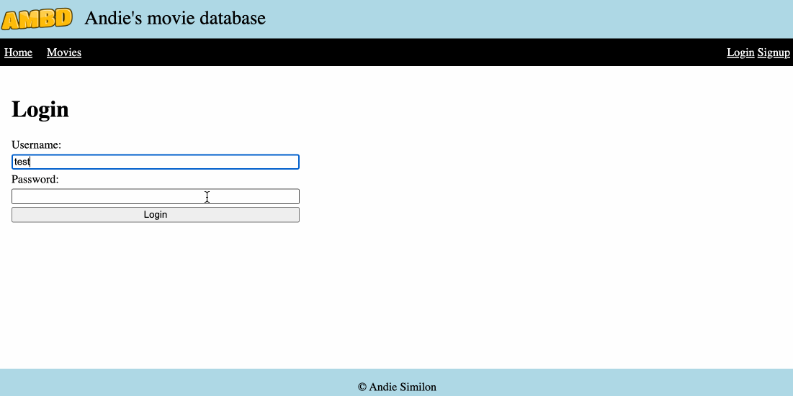

# Labo 7

## myMovieDb

We bouwen in deze oefening een nieuwe **express** applicatie. Zorg ervoor dat deze in een aparte folder staat met dezelfde naam als de oefening. Je maakt het volledig labo in het bestand `index.ts`

Maak een Express applicatie aan die luistert op poort 3000 (zie syllabus).

### Header en footer

Maak een aparte header / footer template die een titel van jouw app, een logo en link naar een css file bevat

* het logo bevindt zich op jouw server. Gebruik dus geen externe urls om het logo te tonen
* gebruik css om jouw header en de andere paginas die we gaan maken te stylen. Hiervoor gebruik je een externe css file die je in jouw header linkt.

De invulling van deze header en footer mag je volledig zelf beslissen. Het kan er ongeveer als volgt uitzien:


### Landing page

Maak een welkom pagina die we kunnen oproepen via http://localhost:3000.&#x20;

* zorg dat je zeker de header en footer template importeert
* zorg dat de landingspagina wat info over jouw app bevat (wat tekst)

### Movies

Maak een movies pagina die we kunnen oproepen via http://localhost:3000/movies

Maak een globale variabele aan movies zoals hieronder:

```typescript
let movies : Movie[] = [
    {name: "The Matrix", myScore: 90},
    {name: "Pulp Fiction", myScore: 100},
    {name: "Monster Hunter", myScore: 5},
    {name: "Blade Runner", myScore: 100}
];
```

* zorg dat je zeker de header / footer template importeert
* toon een lijst van de films van de movies variabel op deze pagina. Gebruik CSS om deze lijst wat stijl te geven.
* zorg dat de landing page naar deze pagina wijst (pas dus de landing page aan)
* zorg dat je via een link naar de landingpage kan

Dit kan er ongeveer als volgt uitzien:


### Movie

Maak een movie pagina die we kunnen oproepen via http://localhost:3000/movies/X waar X een getal is.

* zorg dat je zeker de header/footer template importeert
* toon de film die zich op index X bevindt in de movies array
* zorg dat je bij elke movie op de movies pagina naar de movie pagina van die specifieke film kan gaan via een link.&#x20;
* zorg dat je via een link terug naar de movies pagina kunt
* Hoe rekening met het feit dat de gebruiker een index kan ingeven die hoger is dan het aantal elementen (voorzie een error page)


### AddMovie

Maak een addmovie pagina aan die we kunnen oproepen via http://localhost:3000/addmovie .

* toon een form met 2 velden: Title en My Score
* dit form gebruikt de POST methode
* zorg dat de submit knop de data verstuurt en toevoegt aan de movies array
* Toon een bevestigingsbericht als de film is toegevoegd aan de array en laat terug de movies pagina zien.


app.get('/addmovie',.. en app.post('/addmovie',.. zijn 2 verschillende routes. Gebruik de get route om het formulier te tonen. Gebruik de post route om de data te ontvangen. Beiden kunnen dezelfde EJS file als response terugsturen (zo ziet de gebruiker opnieuw het formulier na het de submitten)



### Uitbreiding (PRO)

* Breidt de webapplicatie uit met een login systeem.
* De gebruiker kan aan de hand van een username en paswoord inloggen op het systeem.
* Alleen users die ingelogd zijn kunnen films toevoegen.
* Zorg dat de paswoorden gehashed (SHA-256) zijn in de database.
* Je kan de session middleware gebruiken voor bij te houden of de gebruiker is ingelogt of niet
  * [https://expressjs.com/en/resources/middleware/session.html](https://expressjs.com/en/resources/middleware/session.html)
* De gebruiker moet zichzelf kunnen uitloggen.
* Maak een signup page voor een gebruiker toe te voegen in de users array.


