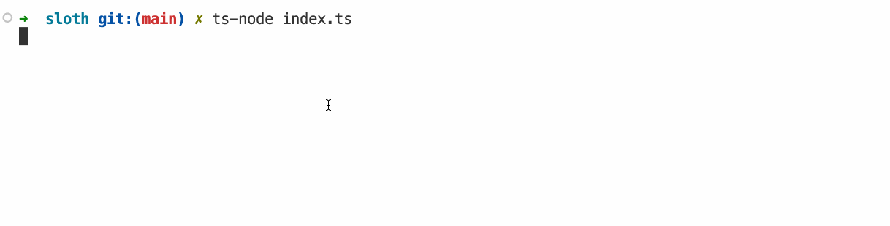

# Extra oefeningen


Deze oefeningen zijn extra oefen materiaal en zijn niet verplicht in te dienen op gitlab. Ze vormen een goede voorbereiding voor het examen of tussentijdse testen.


## CatGPT

In deze oefening gaan we een command line applicatie schrijven die de website https://catgpt.wvd.io/ nabootst. Deze website is een parodie op de zeer bekende chatgpt, alleen geeft hij geen antwoorden op je vragen, maar geeft hij een willekeurig aantal "Meow"s terug.

**Je wordt verwacht labo 1 te hebben uitgevoerd**

### Technische Analyse

* Vraag via readline-sync input van de gebruiker aan de hand van een ">" prompt.
* Maak een functie aan "repeatWords" die een woord een aantal keer herhaalt en afprint. De functie heeft 3 parameters:
  * `word`: het woord dat herhaald moet worden.
  * `times`: het aantal keer dat het woord herhaald moet worden.
  * `delimiter`: het teken dat gebruikt wordt om de woorden te scheiden.
* Gebruik hiervoor de arrow functie syntax.
* Gebruik de npm package "sloth-log" om een tekst vertraagd af te printen. Voor meer informatie bekijk de [documentatie](https://www.npmjs.com/package/sloth-log).
* Zorg ervoor dat elke sequentie van Meow's een willekeurig leesteken krijgt aan het einde (?,! en .).
* Zorg ervoor dat de gebruiker de applicatie kan afsluiten door "bye" in te geven. De kat zal nog een laatste keer een aantal "Meow"'s teruggeven.

### Voorbeeldinteractie

<figure><figcaption></figcaption></figure>

