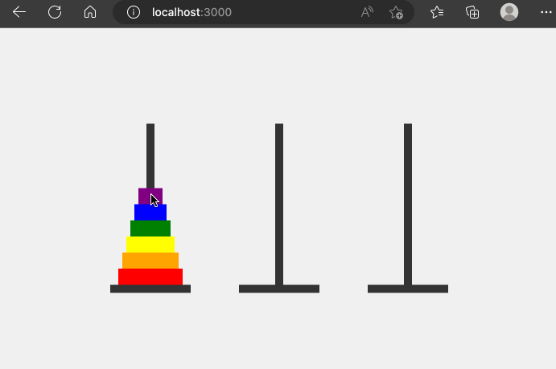

# Hanoi

In deze opgave gaan we een spelletje programmeren. Het spelletje is gebaseerd op het bekende spelletje [Hanoi](https://nl.wikipedia.org/wiki/Toren\_van\_Hanoi). Het spelletje bestaat uit 3 stokken en een aantal schijven. De schijven hebben verschillende diameters. Het doel van het spel is om alle schijven van de eerste stok naar de laatste stok te verplaatsen. Je mag echter maar 1 schijf tegelijk verplaatsen en een schijf mag enkel op een andere schijf geplaatst worden als de diameter van de schijf die je wil verplaatsen kleiner is dan de diameter van de schijf waar je hem op wil plaatsen.

In deze opgave maken we gebruik van 3 stokken en 6 schijven.

### Begin situatie

We hebben een HTML pagina gekregen waarin we de begin situatie van het spelletje kunnen zien. De HTML pagina bevat een aantal elementen die we nodig hebben om het spel te kunnen programmeren.

```html
<!DOCTYPE html>
<html lang="en">
<head>
    <meta charset="UTF-8">
    <meta http-equiv="X-UA-Compatible" content="IE=edge">
    <meta name="viewport" content="width=device-width, initial-scale=1.0">

    <link rel="stylesheet" href="/css/styles.css" />
    <title>Hanoi</title>
</head>
<body>
    <div class="container">
            <div class="pole pole0" id="pole-0" onclick="onClick('0')">
                    <div class="disk disk-0"></div>
                    <div class="disk disk-1"></div>
                    <div class="disk disk-2"></div>
                    <div class="disk disk-3"></div>
                    <div class="disk disk-4"></div>
                    <div class="disk disk-5"></div>  
            </div>
            <div class="pole pole1" id="pole-1" onclick="onClick('1')">  
            </div>
            <div class="pole pole2" id="pole-2" onclick="onClick('2')">
            </div>
    </div>   
    <script src="/js/hanoi.js"></script>
</body>
</html>
```

en het volgende javascript bestand:

```js
let fromPole = null;
let toPole = null;

function onClick(poleid) {
    if (fromPole === null) {
        fromPole = poleid;
    } else {
        toPole = poleid;
        document.location.search = `from=${fromPole}&to=${toPole}`;
    }
    document.getElementById("pole-" + poleid).classList.add('selected');
}
```

en de volgende CSS:

```css
* {
    box-sizing: border-box;
    margin: 0;
    padding: 0;
}
.container {
    display: flex;
    justify-content: center;
    align-items: center;
    height: 100vh;
    background-color: #f0f0f0;
}
.pole {
    width: 10px;
    height: 200px;
    background-color: #333;
    position: relative;
    align-items: center;
    display: flex; /* added this */
    flex-direction: column-reverse; /* added this */
}

.selected {
    background-color: #f00;
}

.pole1 {
    margin-left: 150px
}

.pole2 {
    margin-left: 150px
}

.pole::before {
    content: "";
    width: 100px;
    height: 10px;
    background-color: #333;
    position: absolute;
    bottom: -10px;
    left: -45px;
}

.disk {
    height: 20px;
}

.disk-0 {
    width: 80px;
    background-color: #ff0000;
}

.disk-1 {
    width: 70px;
    background-color: #ffa500;
}

.disk-2 {
    width: 60px;
    background-color: #ffff00;
}

.disk-3 {
    width: 50px;
    background-color: #008000;
}

.disk-4 {
    width: 40px;
    background-color: #0000ff;
}

.disk-5 {
    width: 30px;
    background-color: #800080;
}

.error {
    position: fixed;
    top: 0;
    left: 0;
    width: 100%;
    background-color: rgba(255, 54, 54, 0.89);
    color: #fff;
    padding: 10px;
    text-align: center;
    z-index: 1000;
    font-family: "Roboto", sans-serif;
    font-size: 18px;
    box-shadow: 0 4px 8px rgba(0,0,0,0.2);
}

.success {
    position: fixed;
    top: 0;
    left: 0;
    width: 100%;
    background-color: rgb(43, 228, 43);
    color: #fff;
    padding: 10px;
    text-align: center;
    z-index: 1000;
    font-family: "Roboto", sans-serif; 
    font-size: 18px; 
    box-shadow: 0 4px 8px rgba(0,0,0,0.2); 
}
```

Probeer de HTML pagina te openen in je browser. Je ziet dat er 3 stokken zijn met 6 schijven. De schijven zijn op de eerste stok geplaatst. De schijven zijn oplopend van grootte. De grootste schijf staat onderaan en de kleinste schijf staat bovenaan. Probeer de schijven te verplaatsen door de HTML pagina aan te passen, zorg ervoor dat je de structuur van de HTML goed begrijpt.

### Express app

Maak een nieuwe express applicatie aan en zorg ervoor dat de HTML pagina die je hierboven ziet in de browser te zien is als je naar de root van je applicatie navigeert. De CSS bestanden moeten ook beschikbaar zijn. Gebruik hiervoor ejs om de HTML pagina te renderen.

### Schijven

Maak een array die de beginsituatie van de schijven voorstelt. De array bevat 3 arrays. De eerste array bevat de schijven die op de eerste stok staan. De tweede array bevat de schijven die op de tweede stok staan. De derde array bevat de schijven die op de derde stok staan. De schijven zijn oplopend van grootte. De grootste schijf staat onderaan en de kleinste schijf staat bovenaan.

```typescript
let hanoi: number[][] = [[0,1,2,3,4,5],[],[]];
```

Geef de `hanoi` array mee aan de ejs template. In de ejs template kan je de array gebruiken om de schijven te renderen. De schijven moeten op de juiste plaats in de HTML pagina geplaatst worden. De schijven moeten ook op de juiste plaats in de array geplaatst worden. Gebruik hiervoor de for loop in de ejs template.

Experimenteer met de array en de ejs template om te zien hoe je de schijven kan renderen.

### Schijf verplaatsen

Als je de JavaScript code beter bekijkt dan zie je de lijn

```
    document.location.search = `from=${fromPole}&to=${toPole}`;
```

Deze lijn zorgt ervoor dat de browser een nieuwe pagina laadt. De nieuwe pagina wordt geladen met de query parameters `from` en `to`. De query parameters bevatten de stokken waar de schijf vandaan komt en waar de schijf naartoe moet. De query parameters worden gebruikt om de schijf te verplaatsen.

Pas nu je express applicatie aan zodat je deze query parameters kan gebruiken om de schijf te verplaatsen. De schijf moet verplaatst worden in de array. Je haalt dus een schijf uit de array van de stok waar de schijf vandaan komt (via pop) en je plaatst de schijf in de array van de stok waar de schijf naartoe moet (via push).

Je moet in dit deel nog niet controleren of de schijf verplaatst mag worden. Je mag ervan uitgaan dat de gebruiker de schijven op de juiste manier verplaatst.

### Winnaar

Als de gebruiker alle schijven op de laatste stok heeft geplaatst dan heeft de gebruiker gewonnen. Zorg ervoor dat de gebruiker een bericht krijgt als hij alle schijven op de laatste stok heeft geplaatst. Je kan dit doen door een success bericht door te geven aan de ejs template. In de ejs template kan je dan een bericht tonen als de gebruiker gewonnen heeft.

Je kan nagaan of de gebruiker gewonnen heeft door te kijken of de laatste array in de `hanoi` array 6 schijven bevat.

<figure><figcaption><p>We kijken nog niet na of de blokken mogen verplaatst worden.</p></figcaption></figure>

### Validatie

Niet elke schijf mag op elke schijf geplaatst worden. De grootste schijf mag niet op een kleinere schijf geplaatst worden. De schijf die je wil verplaatsen moet bovenaan staan op de stok waar de schijf vandaan komt. De schijf die je wil verplaatsen moet bovenaan staan op de stok waar de schijf naartoe moet.

Je kan dit doen door na te gaan dat elk getal in de array in de juiste volgorde staat. Bijvoorbeeld:

Juiste volgorde:

```typescript
let hanoi = [[0,1,2,3,4,5],[],[]];
```

Foute volgorde (4 moet voor 5 staan)

```typescript
let hanoi = [[0,1,2,3],[5,4],[]];
```

Foute volgorde (1 moet voor 2 staan)

```typescript
let hanoi = [[0,2,1,3,5],[],[4]];
```

Als de schijf niet verplaatst mag worden dan moet je een foutmelding tonen. Je kan dit doen door een error variabele mee te geven aan de ejs template. De error variabele bevat een string met de foutmelding. De ejs template kan deze string tonen in een HTML element met de class `error`.

<figure><figcaption><p>Nu houden we wel rekening met de foute zetten</p></figcaption></figure>

