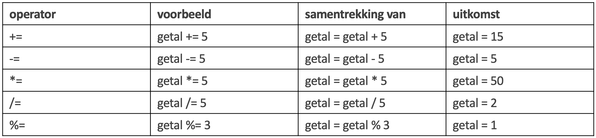
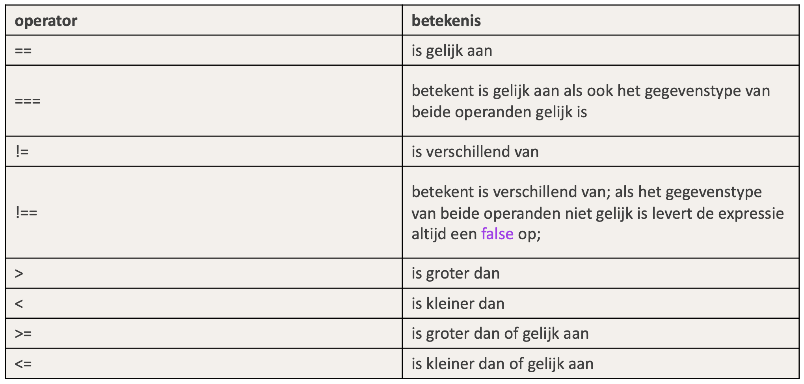

# TypeScript: Operators

## Assignment Operators



## Comparison Operators




Gebruik altijd === en !==


## Logical Operators

```typescript
let a: boolean = true;
let b: boolean = false;
if(a === true){
  console.log("a is true");
}
if(a){
  console.log("a is true");
}
if(!b){
  console.log("b is false")
}
```

Merk op: de conditie verwacht true of false. Dit wil zeggen dat als a true is, we&#x20;

`if(a)`

kunnen schrijven ipv&#x20;

`if(a===true)`

Omgekeerd kunnen we&#x20;

`if(!b)`

ipv

`if(b !=== true)`

of

`if(b === false)`

schrijven.

Als we twee condities willen combineren, gebruiken we `&&` en/of `||`

```typescript
let a: boolean = true;
let b: boolean = false;
if(a && !b){
  console.log("yep, a is true en b is false")
}
```

Hierboven testen we of a waar is en b niet waar is. Dan pas wordt de console.log uitgevoerd.

### Lazy evaluation

TypeScript zal de condities evalueren van links naar rechts. Wanneer TypeScript genoeg info heeft, stopt deze met evalueren. Bv.

```typescript
let a: boolean = true;
let b: boolean = false;
if(a || !b){
  console.log("a is true, we kijken niet meer naar b");
}
```

a is waar. Een OF statement zegt dat 1 van de twee moet waar zijn. Mits a waar is, hoeven we niet verder te zoeken. !b wordt dus niet meer getest.

```typescript
let a: boolean = true;
let b: boolean = false;
if(b && a){
  console.log("a is true, we kijken niet meer naar b");
}
```

Hierboven is b false. Dit is een EN statement. Als 1 van de condities niet waar is, dan is alles niet waar. Dus TypeScript zal a niet meer evalueren.
